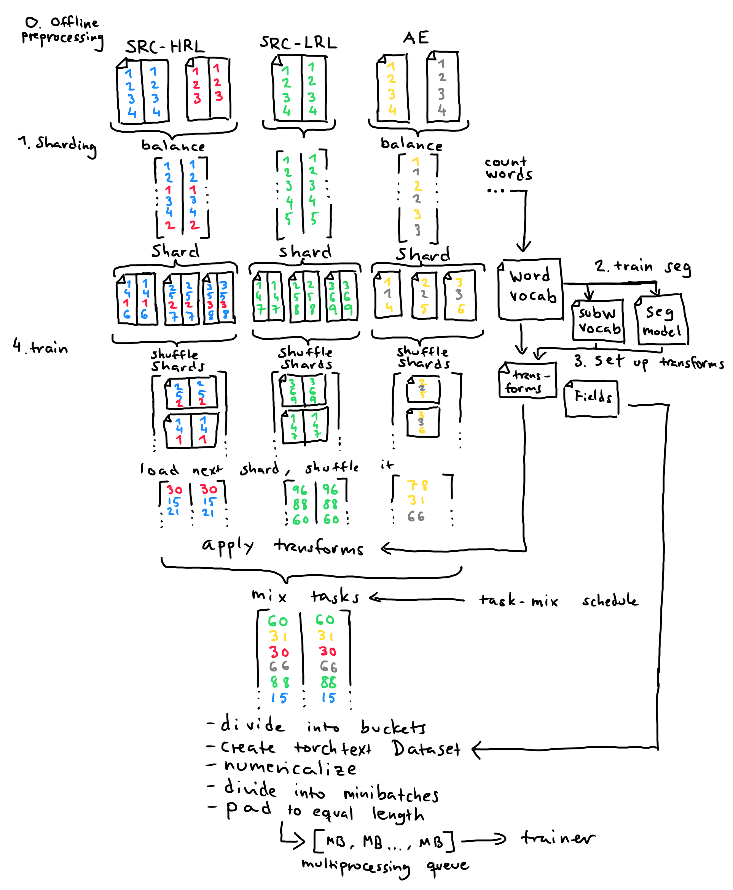
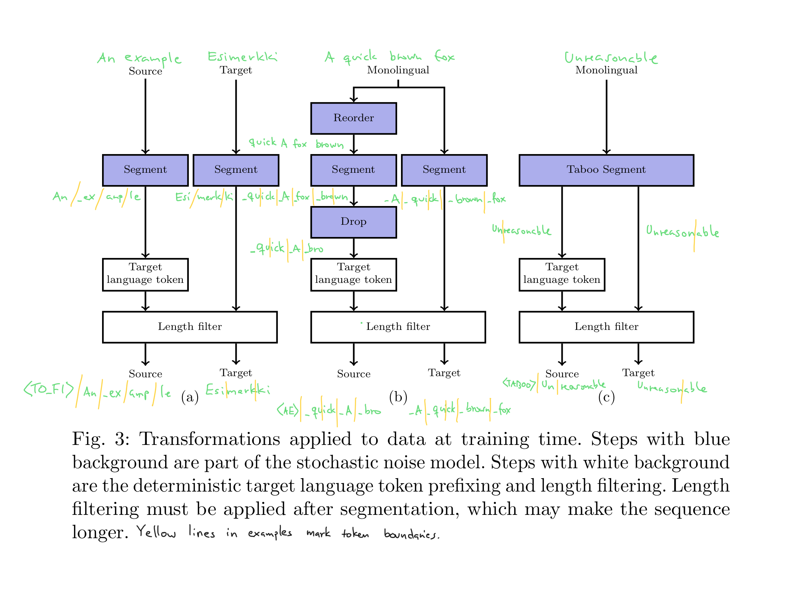

### Usage summary

```
# 0. Offline preprocessing
# 1. Sharding
onmt_preprocess_dynamicdata shard $dataconfig
# 2. Training segmentation model
# 3. Setting up transforms
onmt_preprocess_dynamicdata vocab $dataconfig
# 4. Training translation system
onmt_train_dynamicdata --config $cliconfig --data_config $dataconfig
# 5. Translating
onmt_translate --config $cliconfig --data_config $dataconfig --transforms_from_task $task
```


Dataloader with dynamicly sampled noise and task-mix scheduling
===============================================================

We contribute a replacement for the OpenNMT-py dataloader,
with two new features: dynamicly sampled noise and task-mix scheduling.
The implementation is intended as a prototype to start a discussion
and hopefully to inform the design of a set of changes to the OpenNMT-py dataloader.
The code functions, but is not polished enough to be merged to master outright.

Why do we need sampling?
------------------------

The power of noise as a regularizer has been put to use in many methods advancing deep learning,
such as dropout (Srivastava et al., 2014), label smoothing (Szegedy et al., 2015), and SwitchOut (Wang et al., 2018).
Those three can be applied without changes to the dataloader.
However, recently methods resulting in much larger changes to the sequence,
such as subword regularization (Kudo, 2018), have been proposed.
In subword regularization, the way in which words are segmented into subwords is resampled each time the word occurs.
E.g. "unreasonable" might be segmented into "un + reasonable" once and "unreason + able" the next time, and "un + reason + able" a third time.
When converted into numeric indices into the vocabulary, these representations are very different.

In our recent paper (Grönroos et al., 2020a) seek to improve Neural Machine Translation (NMT)
into morphologically rich low-resource languages.
We use a very small amount of parallel data (10000 sentence pairs is enough),
but still reach a reasonable translation quality by making good use of
abundant monolingual data, and parallel data in a related high-resource language pair.

Our method relies on two new features that we implement into OpenNMT-py:

  1. For subword regularization and the denoising sequence autoencoder, 
     we need the ability to sample slightly different versions each time an example is used in training.
  2. For scheduled multi-task learning we need the ability to adjust the task mix during training.

The task-mix scheduling is important in multilingual settings when different language pairs have different amounts of data,
but can also be useful when mixing other types of data, such as
different domains (oversampling the in-domain data),
natural vs synthetic (e.g. back-translated) data,
and auxiliary tasks (e.g. autoencoder).

Current OpenNMT-py dataloader
-----------------------------

The current dataloader in OpenNMT-py is divided into two parts: preprocessing and training.
During preprocessing, data is divided into shards that fit into memory.
For each shard, a torchtext Dataset is created, hacked a bit, and saved to disk as a pickle.
During training, these shards are loaded, numericalized, divided into minibatches, and padded to the same length,
after which they are ready to be used.

A large amount of work must be done externally prior to running the preprocessing

    1. Cleaning and normalization.
    2. Pretokenization and subword segmentation.
    3. Oversampling data to achieve the desired mix (recently a new feature was introduced which allows a constant oversampling rate to be specified during preprocessing).
    4. Shuffling the data.

The current dataloader is to some extent an abuse of the torchtext library.
This is partly due to bad design choices in torchtext, which make correct usage difficult and unintuitive.
E.g. torchtext doesn't support non-toy-sized datasets that don't fit in memory at once,
necessitating users of the library to write their own sharding solutions.

Pickling Dataset objects is not an elegant solution, and doesn't accomplish very much.
When written to disk, the data is tokenized, but still in symbolic (non-numericalized) form.
There is some speed benefit over the use of plain text files,
as the binary format is faster to read (no need to scan for newlines), and the cost of tokenization is paid in advance.

Unfortunately there are many downsides.
Every variation needs a separate preprocessing run, which takes up a lot of disk space.
The problem is particulary severe for researchers doing experiments on different kinds of preprocessing, e.g. subword segmentation.
In one of my experiments I had over a terabyte of redundant oversampled variants of the same data with different preprocessing.
A constant mixing for corpora was recently introduced, but before that oversampling had to be done in preprocessing.

Proposed alternative
--------------------

### Concepts

**Input corpora**.
Multiple input corpora can be used.
During offline preprocessing, the corpora can be kept separated: there is no need to concatenate them into mixed files.
As the transform processing pipeline is very powerful, the input corpora can stay as (or close to) raw text.
In particular any variant processing steps that you want to experiment with should not be necessary to pre-apply offline.

**Tasks**
A task consists of a particular type of data that should all be treated in the same way.
(Note that these were called "groups" in the original implementation. Old terminology may remain in some places).

  - In multilingual training, different language pairs are separate tasks.
  - To treat back-translated synthetic data differently from natural data (e.g. weight it differenly or prepend a special token),
    the two are made into separate tasks.
  - Adding an autoencoder auxiliary task requires a processing pipeline that is different from the main task.

A task can use data from multiple input corpora, in which case they are mixed together during sharding,
in such a way that each shard contains the same mix of input corpora.
This avoids situations where shards are imbalanced, leading to a long time training on a single corpus.
Examples from different tasks are mixed together during training, using a time-varying task-mix schedule.

Tasks are either parallel or monolingual.
This determines the type of the input corpora, either a separate file for source and target or a single file.
After the processing pipeline is finished, examples from both types of task consist of a source and target side.
More task types could be defined, e.g. for multimodal NMT.

Tasks belong to either the training or the validation split.
Processing for the validation data is controllable in the same way as for training.

**Transforms**
The processing pipeline consists of a series of transforms.
The transforms can modify the data in powerful ways:
make arbitrary changes to the sequence of tokens (including changing its length),
duplicate monolingual data into a source and target side,
or even filter out examples.

### Config files

The data and the transforms that should be applied to it are defined in separate dataloader configs (yaml format), rather than as command line options.
Command line options with the same flexibility would become very complex, and thus difficult to read and modify.

An example sharding data config can be found in `examples/dynamicdata.shard.ural.lowres18k.bt.yaml`.
An example training data config can be found in `examples/dynamicdata.train.ural.lowres18k.bt.jtokemprune16k.faster.mono3.noise2.seq2.yaml`.

Note that the sharding data config is a subset of the train data config.
The common parts need to match exactly.
If only one training run is made, the training data config can be used directly as the sharding data config (the extra values are ignored).
If the same sharding is used in many training runs, the separation of data configs is necessary.

#### Some details about the configs

`meta.shard.pretokenize` and `meta.shard.predetokenize`: whether to run pyonmttok (or undo tokenization, for SentencePiece) when sharding. 
This flexibility allows easily using either raw untokenized corpora and corpora that have been pretokenized because some offline preprocessing step needs it.

`meta.train.name` determines where the transforms are saved. It is possible to use the same transforms with different mixing weights by making another training data config using the same name parameter. Ususally it should be unique, though.

`meta.train.mixing_weight_schedule` determines after which number of minibatches the mixing weights should be adjusted. The `tasks.*.weight` parameters should be of length one longer than this.

`meta.train.*` global parameters for the transforms, e.g. setting the amount of noise.

`tasks.*.meta.src_lang` and `tasks.*.meta.trg_lang` are used by the `lang_prefix_both` transform to produce (target) language tokens. `tasks.*.meta.extra_prefix` can be used to mark synthetic data, such as in the back-translation task `enet_bt` in the example.

`tasks.*.n_shards` allows overriding the number of shards for a single task. Useful if a task is low-resource.

`tasks.*.share_inputs` allows a task to use the same inputs as another task, without the need to shard the data twice. This makes it possible to apply e.g. two different autoencoder tasks to the same monolingual data. In the example `mono_fi_taboo` has `share_inputs: mono_fi`. No inputs should be assigned directly to a task that uses `share_inputs`. 

#### Generating configs from templates

There is a `jinja2` based templating tool for generating training data configs.
This is useful e.g. for applying the same task mix schedule to different data sets.
(Alternatively could have split data and transforms into separate confs, but decided to avoid splitting it up too much.)

`onmt/bin/template_dynamicdata.py --shard_config_file $sharddataconf --template_file $template --out_file $traindataconf family:ural src:en hrl:fi lrl:et`

The `key:value` pairs are template variables to fill in. In the template the variables are marked `{{key}}`.

### Usage

0. **Offline preprocessing:** e.g. cleaning, pretokenization.
   This is an optional step. For computational reasons, anything non-stochastic that is not varied between experiments can be done offline in advance.
1. **Sharding.** `onmt_preprocess_dynamicdata shard $dataconfig` uses the sharding data config. The input corpora for each task are read, mixed together and divided into shards, in such a way that each shard gets the same mix of input corpora. The shards are plain text files. At the same time, a word vocabulary is computed.
2. **Training segmentation model, determining vocabulary.** The segmentation model is trained in the same way as previously. The word vocabulary computed in the previous step can be used. It is important to determine all subwords that the segmentation model might use, in order to determine the NMT model vocabulary.
3. **Setting up transforms.** `onmt_preprocess_dynamicdata vocab $dataconfig` uses the training data config. The torchtext Field objects are created. Transforms are warmed up, e.g. precomputing a cache of segmentation alternatives for the most common words. This is currently important for translation speed (although saving the transforms in the model checkpoint file would solve this better).
4. **Training.** `onmt_train_dynamicdata --config $cliconfig --data_config $dataconfig` uses the training data config.
   During training, the shard ids of each task are shuffled and put into a queue.
   When the queue runs out, it is transparently refilled and reshuffled.
   Thus each task has its own infinite iterator and a separate epoch counter.
   The next shard is loaded from disk, and the examples are shuffled.
   The transforms are applied to the examples in the shard.
   Examples from the different tasks are mixed according to the current task-mix distribution.
   A "bucket" of examples is drawn in this way.
   A new torchtext Dataset is created from this bucket.
   The examples are turned into numbers (indices into the vocabulary), divided into minibatches, and padded to the same length.
   After this they are ready to be sent to the trainer process.
5. **Translating.** `onmt_translate --config $cliconfig --data_config $dataconfig --transforms_from_task $task` uses the training data config.
   In addition, the training task from which the preprocessing steps should be taken must be specified.

New command line options:

  - `--data_config` specifies the path to the training data config.
  - The data config replaces the old data-specifying options `--train_src` etc, which should not be used.
  - `--bucket_size` determines the size of data included in a torchtext Dataset object. May be adjusted to optimize memory consumption.
  - `--transforms_from_task` at translate time, determines from which training task the preprocessing steps should be taken.

### Example




### Available transforms

- `duplicate_mono`: Takes in monolingual data, duplicates it into a source and target side.
- `reorder`: (could also be called: slightly shuffle) Slightly reorder the **source** side.
  The maximum distance a token can move determined by the parameter `reorder_max_dist`.
- `drop`: (could also be called: delete). Random token deletion on the **source** side.
  Strength controlled by the `drop_temperature` parameter (negated exponent: bigger numbers cause less drops).
- `switchout`: Apply SwitchOut to both source and target sides.
  Strength controlled by the `switchout_temperature` parameter.
- `wb_noise`: Add or remove word boundaries on both source and target sides.
  Strength controlled by the `wb_noise_temperature` parameter.
- `insertion`: Random token insertion on both source and target sides.
  Strength controlled by the `insertion_temperature` parameter.
- `lang_prefix_both`: Add both a source and target language token, determined from the task metadata,
  plus optionally a third marker if the `tasks.*.meta.extra_prefix` parameter is set.
  E.g. "<FROM_en> <TO_fi> <BT>".
- `morfessor_em`: Apply Morfessor EM+Prune segmentation to both source and target sides. Input should be pretokenized to separate punctuation from words.
  The parameter `seg_n_samples` controls the length of the n-best list for sampling. To turn off subword regularization, set to 1. `seg_theta` controls the temperature of the sampling.
- `morfessor_em_taboo`: Apply taboo segmentation using Morfessor EM+Prune. Takes in monolingual data, outputs the same data in two segmentation versions that don't share (multi-character) subwords, as source and target.
- `morfessor_em_taboo_reordered`: A special variant of taboo segmentation for use together with reordering. Takes in a source and a target, which must contain the same tokens (but may be in different order).
- `sentencepiece`: Apply SentencePiece segmentation to both source and target sides.
  Input should **not** be pretokenized. If it is, shard with `predetokenize`.
  Same parameters as `morfessor_em`.
- `deterministic_segmentation`: Apply any deterministic segmentation (e.g. BPE). The `segmentation_model` parameter should point to a file containing a mapping from words to their subword segmentations, in the format `<word> <tab> <morph1> <space> ... <morphN>`.
It is important to note that the word list must be complete: any missing word will cause a crash. This is intentional.
Note that deterministic segmentation is incompatible with subword regularization.
- `filter_too_long`: Filters out too long examples. This must be redone after segmentation, which may increase the length of the sequence substantially. Parameter `max_len` controls the maximum length.

More transforms can easily be added as needed.


### Under the hood

#### How the mixing works

During sharding vs during training. During sharding: corpora within each task are divided evenly into the shards. This is a constant mix without oversampling.
During training: tasks are mixed according to the task-mix weight schedule. A single minibatch can contain examples from many different tasks.

Note that the task-mix weight schedule currently counts data minibatches, not parameter updates.
This is relevant when using gradient accumulation or multi-GPU training.
E.g. with gradient accumulated over 4 minibatches, to change mixing distribution after 40k parameter updates the mixing weight schedule in the training data config needs to be set to [160000].

#### Heavy processing in the data loader

Some transforms, such as subword segmentation, may involve heavy computation.
To ensure that the GPU is kept at maximum capacity,
we move the dataloader to a separate process and use a torch.multiprocessing queue to communicate the minibatches to the trainer process. This setup is already implemented in OpenNMT-py for multi-GPU training.

(Note: our cluster is configured with the GPU compute mode set to "Exclusive Process", which means that only one process can access the GPU. Multi-threading would work, but not multi-process. To ensure that only the trainer process accesses the GPU, the current implementation transfers minibatches as CPU tensors, which are sent to the GPU by the trainer. This is less efficient than sending them in the data loader, after which the inter-process communication is very light.)

#### The subword vocabulary

The subword vocabulary must be specified explicitly.
It can not be determined from a segmented corpus,
because if the segmentation is stochastic it is not guaranteed that all subwords occur in a single epoch.
Also, the data is only segmented when needed, but the vocabulary must be fixed at start of training.

Transforms are able to add their own special tokens to the vocabulary,
e.g. target language token or back-translation marker.

#### Debugging

`onmt/bin/debug_dynamicdata.py --data_config $dataconfig --transforms_from_task $task --src $src_in --tgt $tgt_in --src_output $src_out --tgt_output $tgt_out` runs the transforms of a particular task on a sample of data, writing the processed output to files. If the task is monolingual, use `--mono $mono_in` (there are still two outputs). To use the tool, you must first run `onmt_preprocess_dynamicdata vocab`.


Potential improvements / 2do
----------------------------

There are multiple ways in which this prototype could be improved.

### Usability

1. Even more uniform interface for different segmentation methods.

    - Switching segmentation model should be as easy as changing the transform and the segmentation model.
    - Currently other parameters need to be adjusted, or preliminary steps taken.
    - SentencePiece does not support pretokenized input. This requires carefulness with the `pretokenize` (must **not** be set) or `predetokenize` parameters (should be set, if input is tokenized), and resharding.
    - BPE requires segmenting the word vocabulary in advance to produce a segmentation mapping.

1. Cleaner structure of sharded directory.
1. Ability to reuse already sharded corpora, without resorting to symlink-hacks.

    - Usually preferable to shard everything once and then turn off certain tasks by setting their weight to zero,
      but this is not always possible e.g. when adding back-translation later in the project.

1. Automatically determine input corpus sizes.

    - The corpus size is used for the balanced mixing of corpora within a task.
    - It could also be used to ensure shards of even size, but this is not yet implemented.

1. Some parameters are currently not possible to override in train data config.

    - Length of n-best list for sampling (prepopulated during vocabulary construction).
    - Should at least warn if attempting to change the value (now just silently ignored).

1. Communicate the gradient update count from trainer back to data producer, so that it can be used to control mix schedule.
1. Saving transforms in the model checkpoint file

    - Currently the original saved transforms must be available when translating (the model is not self-sufficient).

1. Making the data config for the reverse model (for back-translation) requires more changes than just setting the reverse flag

    - Source and target languages must be flipped to get the right tags.

1. Better tools for debugging pipelines of transforms.

### New features

1. Automatic adjustment of task-mix schedule.

    - Computing the loss separately for each task (task-specific validation sets)
    - Adjusting the task-mix distribution as a function of the task losses.

1. Per-task parameters for transforms (currently global)

    - E.g. different amount of noise for different tasks.

1. More flexibility, e.g. non-shared vocabulary, factored representation (onmt calls them features)
1. Translate-time target is not currently supported (OpenNMT wants to read src and tgt separately)

    - Make a hacky thing that buffers the joint data and exposes it via two objects with a read method.

### Tighter integration

1. Staying closer to current OpenNMT.
    - Using torchtext preprocessing function to apply the transforms. Downside: each field is preprocessed separately, so they cannot interact in any way. In particular this solution cannot split one field into many, which is required for taboo segmentation. However, elegance and maintainability should perhaps be considered more important than flexibility here.
1. torchtext could be extended to support sharding or a streaming interface
1. torch.utils.data.DataLoader

    - Supports loading data in a separate process.
    - It is not used by OpenNMT. Also a bit unclear how it interfaces with torchtext.


References
----------

Grönroos SA, Virpioja S, Kurimo M (2020a)
    Transfer learning and subword sampling for asymmetric-resource one-to-many neural translation. In review.

Grönroos SA, Virpioja S, Kurimo M (2020b)
    Morfessor EM+Prune: Improved subword segmentation with expectation maximization and pruning.
    In: Proceedings of the 12th Language Resources and Evaluation Conference, ELRA, Marseilles, France, to appear
    [arXiv: 2003.03131](https://arxiv.org/abs/2003.03131)

Kudo T (2018)
     Subword regularization: Improving neural network translation models with multiple subword candidates. [arXiv: 1804.10959](http://arxiv.org/abs/1804.10959)

Srivastava N, Hinton G, Krizhevsky A, Sutskever I, Salakhutdinov R (2014)
    [Dropout: a simple way to prevent neural networks from overfitting.](https://dl.acm.org/doi/abs/10.5555/2627435.2670313) The Journal of Machine Learning Research 15(1):1929–1958

Szegedy C, Vanhoucke V, Ioffe S, Shlens J, Wojna Z (2015)
    Rethinking the inception architecture for computer vision. [arXiv: 1512.00567](http://arxiv.org/abs/1512.00567)

Wang X, Pham H, Dai Z, Neubig G (2018)
    SwitchOut: an efficient data augmentation algorithm for neural machine translation. [arXiv: 1808.07512](https://arxiv.org/abs/1808.07512)
